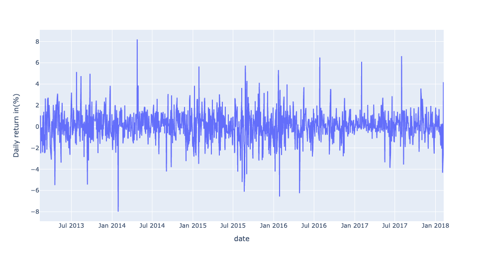
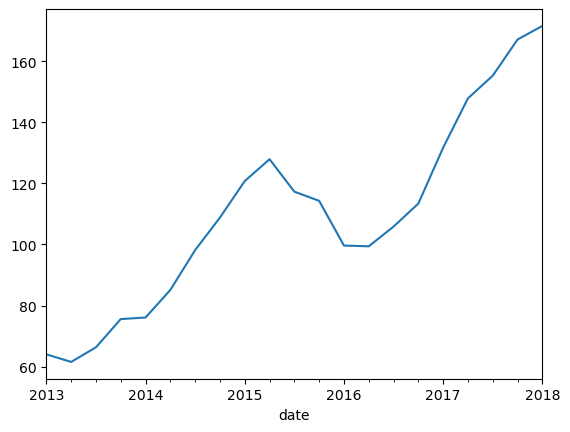
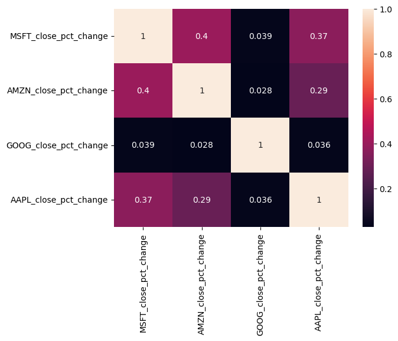

# S&P 500 Stock Price Analysis 🚀📈

## Table of Contents  
1. [Introduction](#introduction)  
2. [Objective](#objective)  
3. [Methodology](#methodology)  
4. [Key Findings](#key-findings)  
5. [Recommendations](#recommendations)  
6. [Conclusion](#conclusion)

---

## Introduction  
Hey there! I’m Zak, and this project was a really fun deep dive into the stock market — especially looking at some of the biggest names in tech: **Apple, Amazon, Google, and Microsoft**.

I used Python (with libraries like **Pandas**, **Matplotlib**, **Seaborn**) to explore how these companies’ stocks have behaved over the last five years. I wanted to figure out not just which ones grew, but *how* they moved — and what kind of patterns they showed along the way.

If you're into investing, trends, or just want to see how to make sense of stock data in a cool way, you're in the right place!

---

## Objective  
The main goal? Take raw stock price data and turn it into something meaningful.

Here’s what I set out to learn:
- What does the long-term price trend look like for each stock?
- Do moving averages help us spot momentum shifts or price stability?
- How volatile are these stocks on a daily basis?
- Can we spot bigger-picture trends if we zoom out to monthly data?
- How closely connected are these big tech names when it comes to their price movements?

---

## Methodology  
Here’s how I broke it all down:
- 📥 **Grabbed the Data**: Five years of daily prices for AAPL, AMZN, GOOG, and MSFT  
- 🧹 **Cleaned Things Up**: Made sure everything was neat and ready for analysis  
- 📏 **Calculated Moving Averages**: 10-, 20-, and 30-day smoothing to see trend shifts  
- 📊 **Visualized the Insights**: Matplotlib helped me tell the story  
- 🔁 **Resampled the Data**: Took a step back and looked at monthly trends too  
- 🔗 **Compared the Stocks**: Ran a heatmap to show how closely they move together  

---

## Key Findings  

### 📊 1. Long-Term Price Growth  
These stocks have seriously taken off, especially **Amazon** and **Google**. It’s pretty awesome seeing how their prices moved from steady growth to big leaps.

---

### 📉 2. Moving Averages Tell a Story  
I looked at 10-, 20-, and 30-day moving averages for all four companies. Sometimes, they were *super close together* — and that usually meant the stock wasn’t too volatile. It gave me confidence that there was some market agreement on their value at those times.

---

### ⚡ 3. Daily Returns (Volatility Check)  
I created a daily returns plot to see how "bumpy" the ride was for each stock. Apple? Surprisingly calm. This tells me it might be a solid pick for someone who wants steady growth without too many rollercoasters.

---

### 🗓️ 4. Monthly Resampling for Apple  
Zooming out to monthly views was super helpful. Apple’s stock has been rising pretty consistently over time, especially after 2016. It’s like watching long-term success unfold.

---

### 🔗 5. Heatmap of Stock Relationships  
Here’s where it got cool. Amazon and Microsoft are *very* closely correlated. The heatmap showed that these stocks tend to move together — probably because of how similar their business strategies are in the tech world.

---

## Recommendations  
Based on all that, here’s what I’d suggest:
- 🧠 **Use moving averages** to figure out good entry/exit points  
- 🍎 **Consider Apple** if you’re into stability and steady growth  
- ⏳ **Watch for patterns** across months — timing your investments matters  
- ⚠️ **Don’t rely on just one tech stock** — they move together, so diversify!  
- 📲 **Stay informed** — markets change quickly with big tech news  

---

## Conclusion  
I had a blast doing this project! It taught me so much about how to read stock data and find patterns that actually mean something. It’s one thing to look at a chart and say “oh that’s up” — but digging into the *why* is what makes it all come alive.

If you're a data nerd like me, or just starting to learn this stuff, I hope this helps you see how fun it can be to mix coding with markets. Thanks for checking it out!

— Zak 😊
