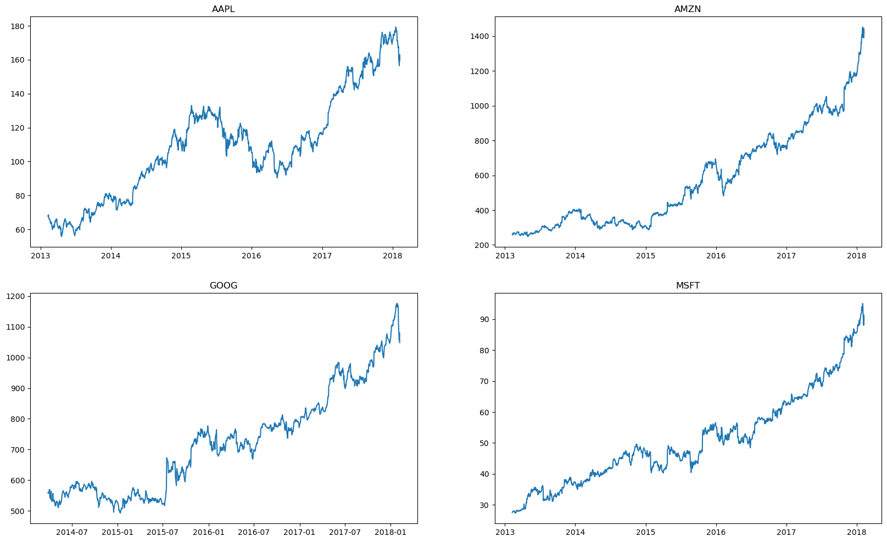
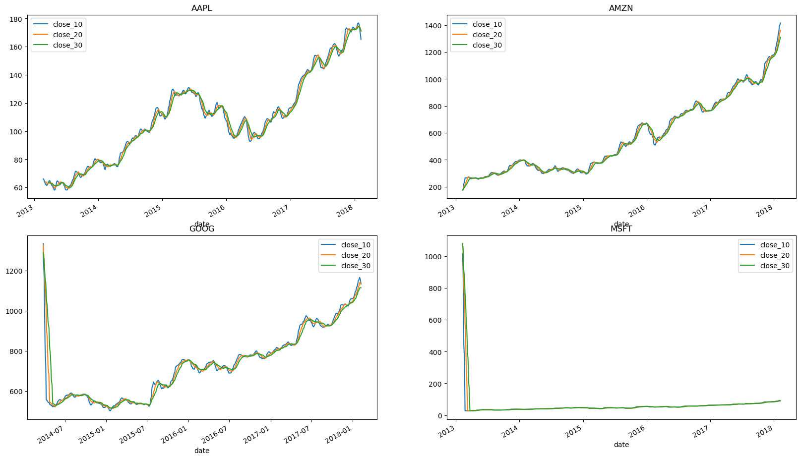

# S&P 500 Stock Price Analysis Report

## Table of Contents  
1. [Introduction](#introduction)  
2. [Objective](#objective)  
3. [Methodology](#methodology)  
4. [Key Findings](#key-findings)  
5. [Recommendations](#recommendations)  
6. [Conclusion](#conclusion)

---

## Introduction  
In this comprehensive analysis, we delve into the intricate world of the S&P 500, focusing specifically on the performance of select tech giants: **Apple, Amazon, Google, and Microsoft**. Leveraging Python's powerful data analysis libraries such as **Pandas**, **NumPy**, **Matplotlib**, and **Seaborn**, we aim to unravel the complexities of stock market data. Our journey begins by sourcing individual stock data spanning **five years**, providing us with a rich dataset to explore various aspects of stock market dynamics.

---

## Objective  
Our analysis encompasses multiple layers, starting with a basic exploration of stock prices over time. We investigate key metrics like **closing prices** and apply **technical analysis tools** such as moving averages to smooth out price fluctuations and gain insights into trends.

Additionally, we explore the concept of **daily returns**, which sheds light on the stock's volatility and investment potential. As we dive deeper, we employ **resampling techniques** to analyze closing prices on different time scales—monthly, quarterly, and yearly.

The crux of our analysis lies in performing a **multivariate analysis**. Here, we examine the **interrelationships** between the stocks of these major tech companies. By exploring correlations, identifying clusters, and spotting outliers, we gain a nuanced understanding of how these stocks interact and influence each other in the complex ecosystem of the stock market.

---

## Methodology  
- **Data Collection**: Sourced five years of historical data for AAPL, AMZN, GOOG, MSFT  
- **Data Cleaning**: Ensured completeness and consistency of financial time series  
- **Technical Analysis**: Applied moving averages (10/20/30-day) to study price trends  
- **Visualization**: Used Matplotlib and Seaborn to bring clarity to market behavior  
- **Resampling**: Aggregated time series to monthly level to detect long-term trends  
- **Multivariate Analysis**: Used correlation matrices to assess stock interdependence

---

## Key Findings  

### 📊 Historical Closing Price Trends  
All four tech stocks demonstrated long-term upward momentum, with **Amazon** and **Google** in particular exhibiting strong multi-year growth. This visual helped benchmark relative stock performance over the five-year period.

---

### 📉 Closely Packed Moving Averages  
The 10-, 20-, and 30-day moving averages across each stock showed prolonged periods of convergence. This indicates **low volatility** and reflects **market consensus** — particularly during stable growth phases or plateau periods.

---

### ⚡ Daily Returns Volatility  
This plot captures **daily return fluctuations** across the tech sector. While some companies showed more aggressive swings, Apple maintained relatively stable behavior — suggesting its reliability as a low-volatility investment.

---

### 🗓️ Monthly Resampling of AAPL  
By resampling to monthly averages, we observed consistent upward trends in Apple stock post-2016, with a few minor dips. This long-term lens supports seasonality insights and macro-level growth trajectory.

---

### 🔗 Correlation Heatmap  
A strong positive correlation exists between **Amazon and Microsoft**, with all four stocks displaying high levels of synchronization. This finding reinforces the case for understanding sector-linked risk when allocating assets.

---

## Recommendations  
- **Monitor Moving Averages**: Use convergence and divergence to signal low-risk entry or exit points  
- **Consider Apple as a Stable Asset**: Given its low daily volatility and strong long-term trend  
- **Leverage Seasonality**: Use monthly trends to time market entries in Q1/Q4  
- **Be Aware of Tech Sector Correlation**: Diversification across highly correlated tech giants may limit downside protection  
- **Track Market Sentiment**: Volatility shifts and synchronized moves often foreshadow sector-wide change

---

## Conclusion  
Our deep dive into these S&P 500 tech stocks revealed meaningful patterns in volatility, price movement, and inter-stock relationships. The use of moving averages, resampling, and correlation analysis gave us a robust toolkit for evaluating investment risk and strategy.

This project sharpened not only our technical proficiency but also our ability to **translate data into action** — making it highly relevant for roles in financial analytics, equity research, or data-driven investment strategy.
